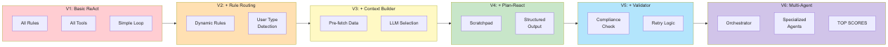
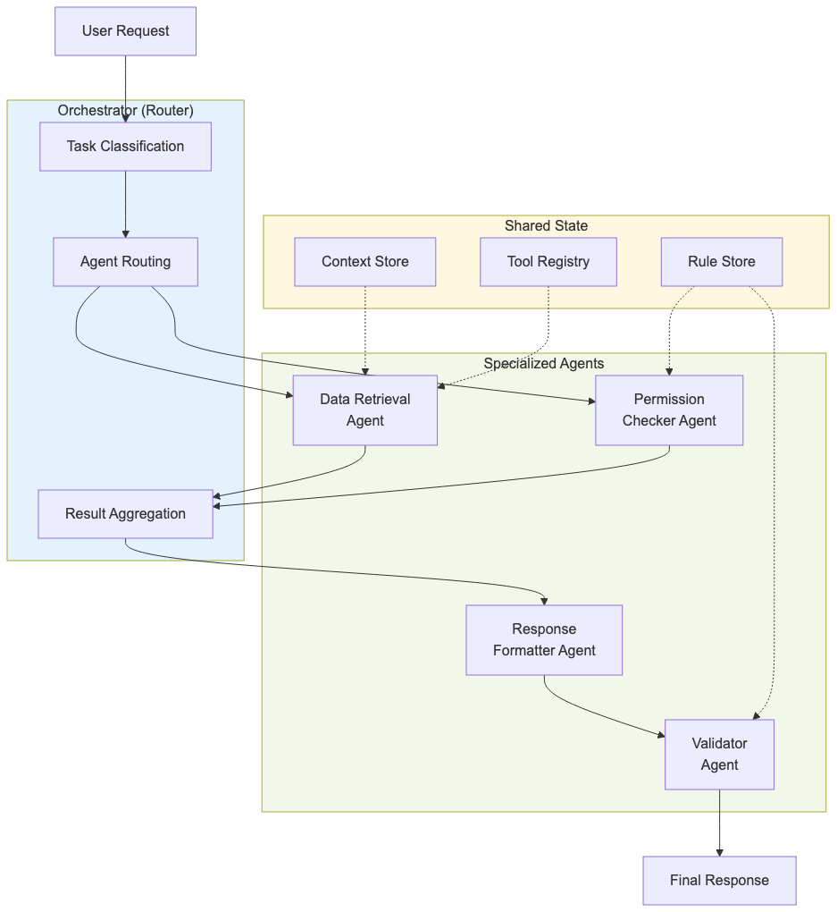

# Enterprise AI Agent Architecture - Seed Document

> **Source:** Interview with Ilya Ris on ERC3 (Enterprise RAG Challenge 3) results
> **Video:** https://youtu.be/3JYHMMw5WSU
> **Key Achievement:** Achieved top benchmark results using open-source model (GPT OSS 120B) comparable to Claude Opus/Sonnet
> **Generated:** 2026-01-05

---

## Executive Summary

This document captures architectural patterns, decisions, and insights from a technical interview about building high-performance AI agents for enterprise applications. The key finding: **agent architecture matters more than model size**. By implementing proper context engineering, dynamic prompt construction, and multi-agent patterns, an open-source 120B model achieved results comparable to proprietary models costing 10-100x more.

### Core Thesis

> "High-performing agents are less about 'bigger models' and more about managing context and process."

---

## Table of Contents

1. [Architectural Patterns](#architectural-patterns)
2. [Implementation Decisions](#implementation-decisions)
3. [Solution Evolution](#solution-evolution)
4. [Keywords & Terminology](#keywords--terminology)
5. [Development Roadmap](#development-roadmap)
6. [Code Architecture](#code-architecture)
7. [Enterprise Considerations](#enterprise-considerations)

---

## Visual Architecture

### Complete Agent Architecture Flow


### Solution Evolution (V1 → V6)


### Multi-Agent Orchestration Pattern


---

## Architectural Patterns

### Pattern 1: Preparation Phase (prepWork)

**Problem:** Static system prompts don't scale with complex rule sets.

**Solution:** Pre-process context BEFORE the main agent starts.

```
┌─────────────────────────────────────────────────────────────┐
│                    PREPARATION PHASE                         │
├─────────────────────────────────────────────────────────────┤
│  1. Fetch Wikipedia/Knowledge Base                          │
│  2. Extract rules from markdown files                        │
│  3. Cluster rules by user type:                             │
│     - Authorized user rules                                  │
│     - Public/guest user rules                               │
│     - Response formatting rules                              │
│  4. Cache results (use hash for invalidation)               │
└─────────────────────────────────────────────────────────────┘
```

**Key Insight:** Wikipedia hash provided by API allows caching. Heavy extraction happens once, not per request.

---

### Pattern 2: Dynamic System Prompt Construction

**Problem:** Including all rules creates noise, reduces signal-to-noise ratio.

**Solution:** Assemble system prompt dynamically per request.

```
┌──────────────────────────────────────────────────────────────┐
│               DYNAMIC SYSTEM PROMPT                           │
├──────────────────────────────────────────────────────────────┤
│                                                               │
│  ┌─────────────┐   ┌─────────────┐   ┌─────────────┐        │
│  │ Base Rules  │ + │ User-Type   │ + │ Relevant    │        │
│  │  (always)   │   │   Rules     │   │  Context    │        │
│  └─────────────┘   └─────────────┘   └─────────────┘        │
│                           │                                   │
│                    ┌──────┴──────┐                           │
│                    │  Authorized │                           │
│                    │  vs Public  │                           │
│                    └─────────────┘                           │
│                                                               │
│  Result: Focused prompt with only applicable instructions    │
└──────────────────────────────────────────────────────────────┘
```

**Implementation:**
1. Identify user type from HMI endpoint
2. Route to appropriate rule set
3. Append only relevant context
4. Optionally filter available tools

---

### Pattern 3: Context Builder Pre-processing

**Problem:** Agent wastes tokens fetching data that could be pre-loaded.

**Solution:** Programmatic data fetch + LLM selection before main agent.

```
┌─────────────────────────────────────────────────────────────┐
│                  CONTEXT BUILDER FLOW                        │
├─────────────────────────────────────────────────────────────┤
│                                                              │
│  Step 1: Programmatic Fetch (No LLM)                        │
│  ┌─────────────────────────────────────────────────────┐   │
│  │ • Get employee profile                               │   │
│  │ • Get all projects employee participates in          │   │
│  │ • Get all clients where employee is account manager  │   │
│  │ • Get time log entries                               │   │
│  │ • Get related entities                               │   │
│  └─────────────────────────────────────────────────────┘   │
│                           ▼                                  │
│  Step 2: LLM Selection (One call)                           │
│  ┌─────────────────────────────────────────────────────┐   │
│  │ Input: All fetched data + Task text                  │   │
│  │ Output: Selection of relevant data blocks            │   │
│  └─────────────────────────────────────────────────────┘   │
│                           ▼                                  │
│  Step 3: Main Agent Starts                                  │
│  ┌─────────────────────────────────────────────────────┐   │
│  │ Has: Relevant rules + Relevant context + Task        │   │
│  └─────────────────────────────────────────────────────┘   │
│                                                              │
└─────────────────────────────────────────────────────────────┘
```

**Key Insight:** "Signal-to-noise ratio" - too many irrelevant rules = noise, harder to navigate.

---

### Pattern 4: Plan-React Agent Architecture

**Problem:** Pure ReAct can wander, especially with smaller models.

**Solution:** Plan first, then execute with structured output.

```
┌─────────────────────────────────────────────────────────────┐
│              PLAN-REACT vs REACT                             │
├─────────────────────────────────────────────────────────────┤
│                                                              │
│  ReAct (Traditional):                                        │
│  Thought → Action → Observation → Thought → Action → ...    │
│                                                              │
│  Plan-React (Improved):                                      │
│  Plan → Execute Step 1 → Observe → Execute Step 2 → ...     │
│                                                              │
│  Structured Output Format:                                   │
│  {                                                           │
│    "scratchpad": "Internal reasoning (not shown to user)",  │
│    "action_type": "tool_call | final_answer | clarify",     │
│    "action_input": { ... } | "response text",               │
│    "confidence": 0.85                                        │
│  }                                                           │
│                                                              │
└─────────────────────────────────────────────────────────────┘
```

**Scratchpad Benefits:**
- Forces explicit reasoning
- Provides debugging visibility
- Can be analyzed by validator
- Improves decision quality

---

### Pattern 5: Agent Validator

**Problem:** Main agent may produce responses that violate rules.

**Solution:** Separate validation layer checks compliance before output.

```
┌─────────────────────────────────────────────────────────────┐
│                  VALIDATOR PATTERN                           │
├─────────────────────────────────────────────────────────────┤
│                                                              │
│  Main Agent                                                  │
│      │                                                       │
│      ▼                                                       │
│  ┌─────────────────┐                                        │
│  │   Validator     │ ◄── Rules + Original Task              │
│  │   (Smaller LLM) │                                        │
│  └────────┬────────┘                                        │
│           │                                                  │
│     ┌─────┴─────┐                                           │
│     ▼           ▼                                           │
│  APPROVE     REJECT                                          │
│     │           │                                            │
│     ▼           ▼                                            │
│  Send to    Retry with                                       │
│   User      Feedback                                         │
│             (max 2-3)                                        │
│                                                              │
└─────────────────────────────────────────────────────────────┘
```

**Cost Efficiency:** Validator uses smaller/faster model - focused task, binary output.

---

### Pattern 6: Multi-Agent Orchestration

**Problem:** Single agent handling everything has context bloat.

**Solution:** Specialized agents coordinated by orchestrator.

```
┌─────────────────────────────────────────────────────────────┐
│              MULTI-AGENT ARCHITECTURE                        │
├─────────────────────────────────────────────────────────────┤
│                                                              │
│                    ┌──────────────┐                         │
│                    │ Orchestrator │                         │
│                    │   (Router)   │                         │
│                    └──────┬───────┘                         │
│                           │                                  │
│         ┌─────────────────┼─────────────────┐               │
│         ▼                 ▼                 ▼               │
│  ┌─────────────┐  ┌─────────────┐  ┌─────────────┐         │
│  │    Data     │  │ Permission  │  │  Response   │         │
│  │  Retrieval  │  │   Checker   │  │  Formatter  │         │
│  │    Agent    │  │    Agent    │  │    Agent    │         │
│  └─────────────┘  └─────────────┘  └─────────────┘         │
│                                                              │
│  Benefits:                                                   │
│  • Focused context per agent                                 │
│  • Different models per task complexity                      │
│  • Parallel execution possible                               │
│  • Easier debugging                                          │
│                                                              │
└─────────────────────────────────────────────────────────────┘
```

---

### Pattern 7: Tool Filtering

**Problem:** 20-24 tools overwhelm the agent's decision space.

**Solution:** Provide only relevant tools based on task classification.

```
Task: "What's my salary?"
├── Relevant tools: get_employee, get_salary_info
├── Excluded: project tools, time log tools, wiki tools
└── Result: Faster, more accurate decisions

Task: "Update the project description"
├── Relevant tools: get_project, update_project, get_employee
├── Excluded: salary tools, time log tools
└── Result: Focused action space
```

---

## Implementation Decisions

### Decision 1: Rule Extraction Strategy

| Approach | Pros | Cons | Chosen |
|----------|------|------|--------|
| All rules in prompt | Simple | Doesn't scale | No |
| RAG for rules | Flexible | Latency, may miss rules | No |
| Pre-extract + route | Fast, complete | Upfront processing | **Yes** |

**Rationale:** Pre-extraction allows complete rule coverage with minimal runtime overhead.

---

### Decision 2: Context Selection Method

| Approach | Pros | Cons | Chosen |
|----------|------|------|--------|
| Include everything | Complete | Token waste, noise | No |
| Semantic search | Efficient | May miss related data | No |
| LLM selection | Intelligent | One extra LLM call | **Yes** |

**Rationale:** LLM can understand task intent and select contextually relevant data.

---

### Decision 3: Model Selection Strategy

| Component | Model Size | Rationale |
|-----------|------------|-----------|
| Orchestrator | Small/Medium | Simple routing logic |
| Context Builder | Medium | Selection, not generation |
| Main Agent | Best available | Complex reasoning |
| Validator | Small | Binary decision |

**Cost Impact:** 50-70% cost reduction vs using best model everywhere.

---

### Decision 4: Error Handling Strategy

| Error Type | Handling | Retry |
|------------|----------|-------|
| Tool failure | Try alternative approach | Yes (2x) |
| Permission denied | Explain to user | No |
| Validation failure | Feedback to agent | Yes (3x) |
| Context overflow | Compress history | No |

---

## Solution Evolution

The agent architecture evolved through 6 major iterations:

```
┌─────────────────────────────────────────────────────────────┐
│                   EVOLUTION TIMELINE                         │
├─────────────────────────────────────────────────────────────┤
│                                                              │
│  V1: Basic ReAct                                            │
│  └── All rules, all tools, simple loop                      │
│      Result: Baseline, many errors                          │
│                                                              │
│  V2: + Rule Routing                                         │
│  └── Dynamic rules by user type                             │
│      Result: Better permission handling                      │
│                                                              │
│  V3: + Context Builder                                      │
│  └── Pre-fetch + LLM selection                              │
│      Result: Reduced noise, better relevance                │
│                                                              │
│  V4: + Plan-React + Structured Output                       │
│  └── Scratchpad, explicit planning                          │
│      Result: More consistent behavior                        │
│                                                              │
│  V5: + Agent Validator                                      │
│  └── Rule compliance checking                               │
│      Result: Higher quality outputs                          │
│                                                              │
│  V6: + Multi-Agent Orchestration                            │
│  └── Specialized agents, routing                            │
│      Result: TOP BENCHMARK SCORES                            │
│                                                              │
└─────────────────────────────────────────────────────────────┘
```

---

## Keywords & Terminology

### Agent Architecture

| Term | Definition |
|------|------------|
| **Plan-React** | Agent pattern: create plan before execution |
| **ReAct** | Reason-Act-Observe iterative loop |
| **Orchestrator** | Coordinator for multi-agent systems |
| **Validator** | Quality control agent checking compliance |
| **Context Builder** | Pre-processing component for context selection |
| **Scratchpad** | Internal reasoning capture (not shown to user) |

### Context Engineering

| Term | Definition |
|------|------------|
| **Signal-to-noise ratio** | Relevance of context to task |
| **Cognitive capacity** | LLM's ability to follow instructions |
| **Dynamic system prompt** | Runtime-assembled instructions |
| **Rule routing** | Selecting applicable rules per request |
| **Tool filtering** | Dynamic tool availability based on task |
| **Context compression** | Reducing history while preserving meaning |

### Enterprise AI

| Term | Definition |
|------|------------|
| **ERC3** | Enterprise RAG Challenge 3 (benchmark) |
| **Soft permissions** | Natural language access rules |
| **HMI endpoint** | Human-Machine Interface (user identity) |
| **Wikipedia (internal)** | Company knowledge base |
| **RBAC** | Role-Based Access Control |

### Performance & Cost

| Term | Definition |
|------|------------|
| **Token efficiency** | Minimizing context size |
| **Multi-model strategy** | Different models for different tasks |
| **Preflight check** | Pre-execution validation |
| **Fallback model** | Backup when primary fails |
| **Batch processing** | Grouping similar operations |

---

## Development Roadmap

### Priority 1: Must Implement (Foundation)

- [ ] **Dynamic System Prompt Construction**
  - Route rules by user type/context
  - Include only relevant instructions
  - Template-based assembly

- [ ] **Context Builder Pre-processing**
  - Programmatic data fetching
  - LLM-based relevance selection
  - Caching strategy

- [ ] **Structured Output with Scratchpad**
  - JSON schema validation
  - Reasoning capture
  - Debugging support

### Priority 2: Should Implement (Quality)

- [ ] **Agent Validator Pattern**
  - Separate validation call
  - Rule compliance checking
  - Retry mechanism

- [ ] **Tool Filtering**
  - Task classification
  - Dynamic tool set
  - Reduced cognitive load

### Priority 3: Could Implement (Scale)

- [ ] **Multi-Agent Orchestration**
  - Specialized agents
  - Routing logic
  - Parallel execution

- [ ] **Context Compression**
  - History summarization
  - Tool result truncation
  - Sliding window

---

## Code Architecture

### Recommended Project Structure

```
agent-system/
├── src/
│   ├── agents/
│   │   ├── orchestrator.py      # Multi-agent coordinator
│   │   ├── main_agent.py        # Plan-React agent
│   │   ├── validator.py         # Response validator
│   │   └── context_builder.py   # Context selection
│   ├── preparation/
│   │   ├── rule_extractor.py    # Extract rules from wiki
│   │   ├── rule_router.py       # Route rules by user type
│   │   └── cache_manager.py     # Cache for extracted rules
│   ├── tools/
│   │   ├── tool_registry.py     # All available tools
│   │   ├── tool_filter.py       # Dynamic tool selection
│   │   └── api_clients/         # API endpoint clients
│   ├── prompts/
│   │   ├── system_prompt.py     # Dynamic prompt builder
│   │   ├── templates/           # Prompt templates
│   │   └── scratchpad.py        # Scratchpad handling
│   └── utils/
│       ├── structured_output.py # JSON schema validation
│       ├── error_handler.py     # Error handling
│       └── logger.py            # Tracing & debugging
├── tests/
├── config/
│   ├── models.yaml              # Model configurations
│   ├── rules.yaml               # Rule definitions
│   └── tools.yaml               # Tool definitions
└── README.md
```

### Key Interfaces

```python
# Context Builder Interface
class ContextBuilder:
    def fetch_user_data(self, user_id: str) -> UserContext:
        """Programmatically fetch all user-related data"""
        pass

    def select_relevant(self, context: UserContext, task: str) -> RelevantContext:
        """Use LLM to select task-relevant data"""
        pass

# Dynamic Prompt Builder Interface
class PromptBuilder:
    def build(self, user_type: str, relevant_context: RelevantContext,
              available_tools: list[Tool]) -> str:
        """Assemble system prompt dynamically"""
        pass

# Validator Interface
class Validator:
    def validate(self, response: AgentResponse, rules: list[Rule],
                 task: str) -> ValidationResult:
        """Check response compliance with rules"""
        pass
```

---

## Enterprise Considerations

### Security

- **Trust Boundaries:** Agent has full API access, users don't
- **Prompt Injection:** Validate user input, especially for guests
- **Data Leakage:** Validate responses against permission rules
- **Audit Trail:** Log all tool calls and decisions

### Scalability

- **Caching:** Cache extracted rules (use hash invalidation)
- **Parallel Execution:** Independent subtasks can run parallel
- **Model Selection:** Use cheaper models for simple tasks
- **Batching:** Group similar operations

### Cost Optimization

| Strategy | Savings | Implementation |
|----------|---------|----------------|
| Multi-model | 50-70% | Route by task complexity |
| Context reduction | 20-30% | Filter irrelevant data |
| Caching | 10-20% | Cache rule extraction |
| Open source | 90%+ | Self-host 120B model |

### Compliance

- **Data Residency:** Self-hosted models keep data in-house
- **Audit Logs:** Complete trace of all agent actions
- **Explainability:** Scratchpad provides reasoning visibility
- **Access Control:** Natural language policies supported

---

## References

- **Open Source Repository:** [GitHub - Ilya Ris ERC3 Solution](https://github.com/)
- **ERC3 Benchmark:** Enterprise RAG Challenge by Renat Abdulin
- **Visualization Tool:** GitHub Pages trace visualizer

---

## Next Steps for Development

1. **Study the open-source code** - The solution is available on GitHub
2. **Implement Context Builder** - Start with programmatic fetch + LLM selection
3. **Add Structured Output** - JSON schema with scratchpad
4. **Implement Validator** - Separate compliance checking
5. **Benchmark locally** - Use ERC3 test cases
6. **Iterate on prompts** - The prompts are where the magic happens

---

*This document serves as a seed for developing enterprise-grade AI agent systems. The patterns described have been validated against real benchmarks and represent production-ready architectural decisions.*
